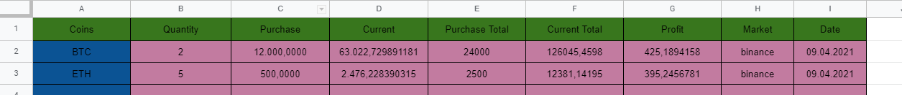

# googlesheet-with-coinmarketcapapi
Crypto coin portfolio manager on google sheet with coinmarketcap api

You should change the sheet names according to do given names by you. I have added the coin id like "BTC" or "ETH" to the first column and setting the current price to the 4th column. You can change also the column number according to your structure.

